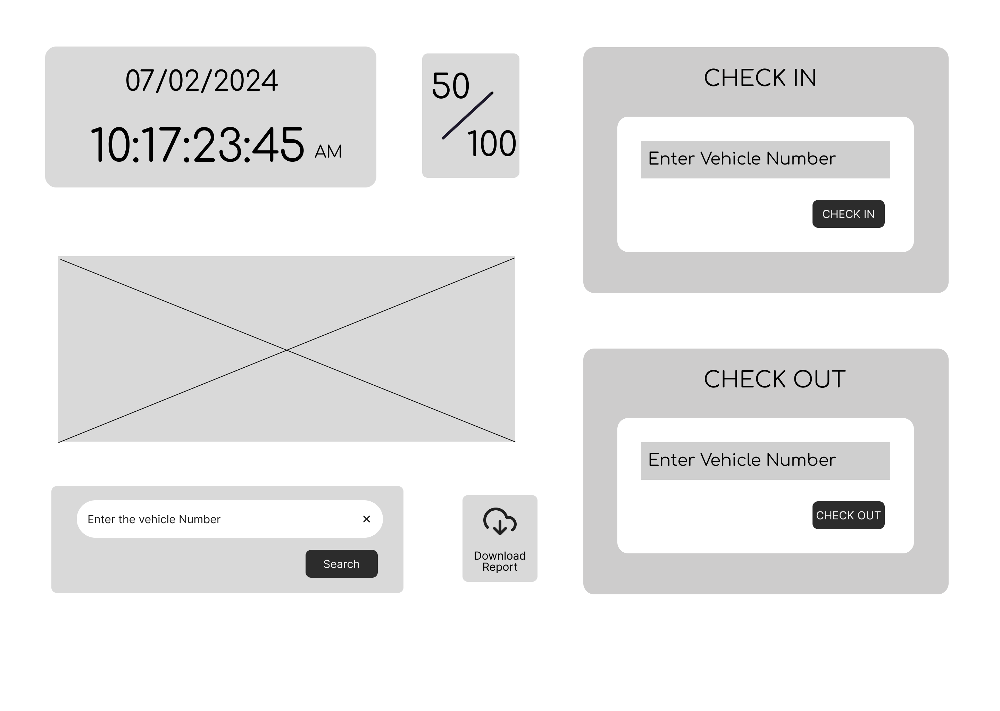

# Vehicle Parking Management System

## Overview
The Vehicle Parking Management System is designed to efficiently manage vehicle parking in various environments such as malls, corporate buildings, residential areas, and public parking spaces. The system aims to streamline parking operations, reduce congestion, and enhance user experience through automation and digital tracking.

## Objective
- To develop a user-friendly and efficient parking management system.
- To automate the process of vehicle entry, exit, and payment.
- To optimize space utilization and reduce manual intervention.
- To provide real-time tracking and availability updates.
- To generate reports for analytics and decision-making.

## Project Workflow
1. **Admin Login**
   - Only the admin has access to the system.
   - Role-based access control for security.

2. **Parking Management Pages**
   - **Check In:** Logs vehicle entry details.
   - **Check Out:** Records vehicle exit and calculates charges.
   - **Status:** Displays real-time parking slot availability.
   - **Count of Slots:** Provides an overview of occupied and vacant slots.

3. **Payment Processing**
   - Integration with digital payment gateways.
   - Auto-calculated charges based on duration and parking type.

4. **Reporting & Analytics**
   - Daily, weekly, and monthly reports for revenue and usage.
   - Predictive analytics for optimizing parking capacity.

## Tech Stack
- **Frontend:** React.js, Tailwind CSS
- **Backend:** Node.js, Express.js
- **Database:** MongoDB
<!-- - **Authentication:** JWT, OAuth -->
<!-- - **Payment Integration:** Stripe/PayPal -->
<!-- - **Deployment:** AWS/GCP/DigitalOcean -->
<!-- - **Other Tools:** Docker, GitHub Actions, WebSockets for real-time updates -->

### Layout Image
